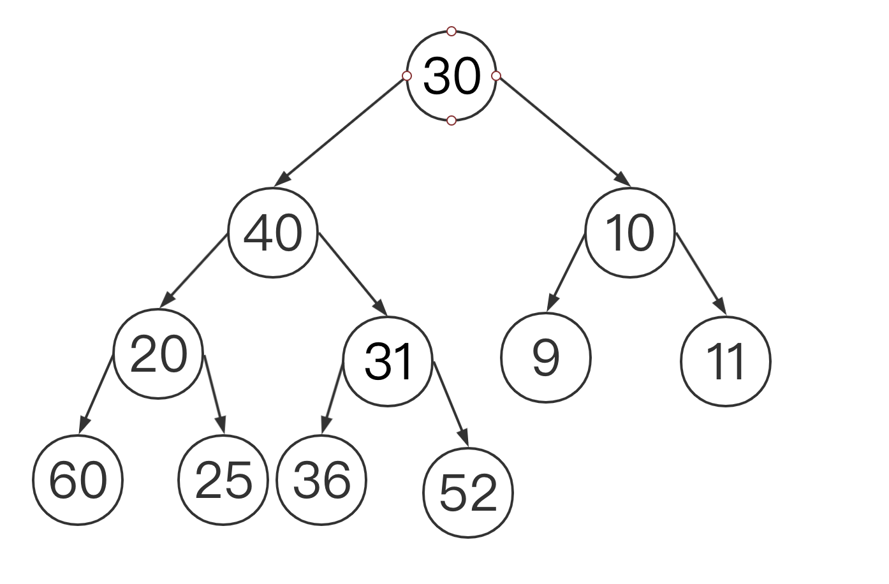
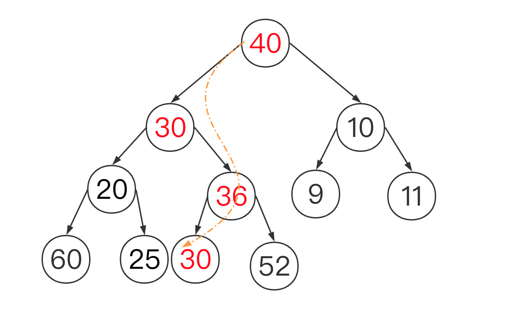
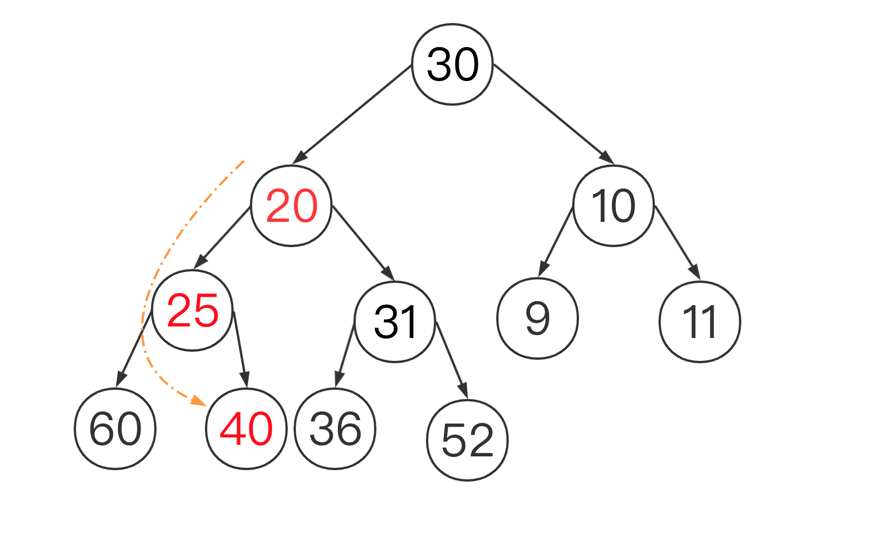

# 优先队列


## 堆排序

## 基础概念

sink 下沉

我们选择数字小的下沉，从而构建 大根堆，再通过将根节点，与末尾节点置换，再sink() 从而使得从小到大排序


#### 数字小的sink






#### 数字大的sink

以 40 来看，它大于节点20，31，它需要和他的子节点进行位置交换，一般选更小的，选20，

然后还比25 大，继续下城 





### 堆排序的步骤

```
1) 从第一个有非null的子节点的节点开始，也就是原图的 31 那个节点
2) 对该节点进行 sink()
3) 位置左移动 也就是找到左边的节点，其实就是下一个该进行sink操作的节点
4) 该节点是 根节点吗 是 到第五步，不是，回到第二步
// 到了第五步之前，也就是建立大根堆：所有节点的值大于其子节点的值
5）找到最后的位置 j
6) j == 1 ? 是，第九步；不是，第7步
7）根节点的值 与 j的值互换
8）最后的位置-1，回到第5步
9) end
```


```java
package learnHeap.imitation;

public class Heap {

    public static void sort(Comparable[] pq){
        int n = pq.length;


        // 生成 大根堆
        for(int k = n/2;k>=1;k--){
            sink(pq,k,n);
        }

        //通过交换
        //使得每次最大的在底部

        int k= n;
        while( k>1) {
            swap(pq, 1, k--);
            sink(pq, 1, k);
        }
    }

    private static void sink(Comparable[] pq, int k,int n){

        int t= 2*k;
        while(t<=n){
            int j = 2*k;
            if(j < n && less(pq,j,j+1)){
                j++;
            }
            if(!less(pq,k,j)){
                break;
            }
            swap(pq,k,j);
            k=j;
            t=2*k;

        }


    }

    private static void swap(Object[] pq,int i,int j) {
        Object temp = pq[i-1];
        pq[i-1] = pq[j-1];
        pq[j-1] = temp;
    }

    private static boolean less(Comparable[] pq,int i,int j){
        return pq[i].compareTo(pq[j])<=0?true:false;
    }

    private static void show(Comparable[] a) {
        for (int i = 0; i < a.length; i++) {
            System.out.println(a[i]);
        }
    }


    public static void main(String[] args) {
//        Integer [] arr ={4,3,2,1,0} ;
        Integer[] arr = {53,5,23,15,25,97,435,32,11};

        learnHeap.Heap.sort(arr);
        show(arr);
    }
}

```

