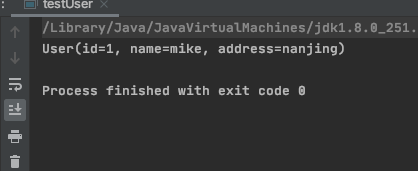

学习 lombok 的 @builder 标签

User.java

```
import lombok.Builder;
import lombok.ToString;


@Builder
@ToString
public class User {

    private Integer id;
    private String name;
    private String address;

}
```

testUser.java

```
public class testUser {

    public static void main(String[] args) {
        User u= User.builder()
                .id(1)
                .name("mike")
                .address("nanjing")
                .build();
        System.out.println(u);
    }

}
```





